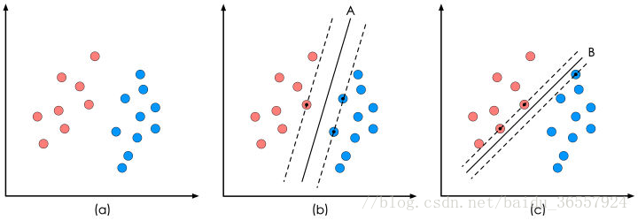
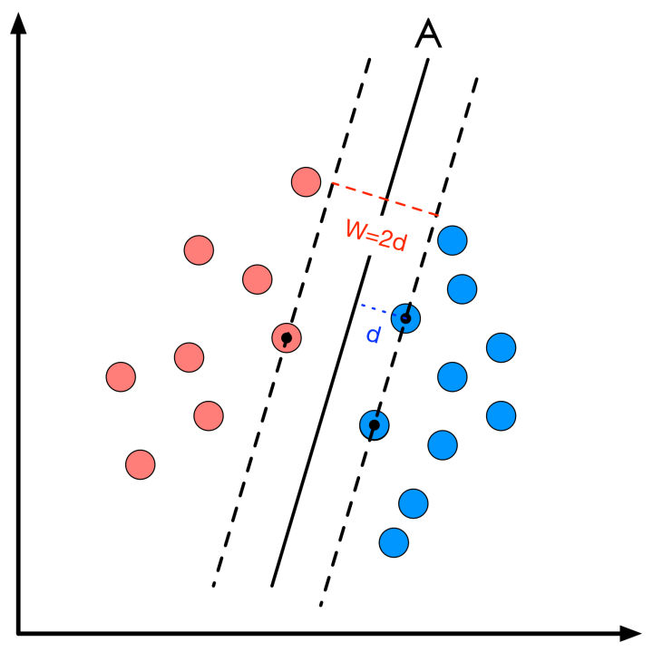
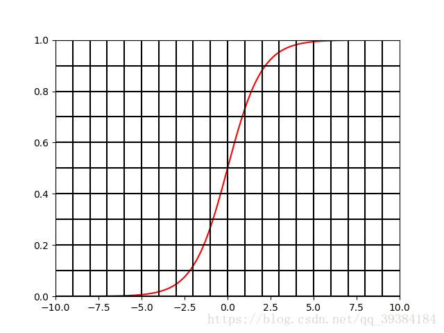
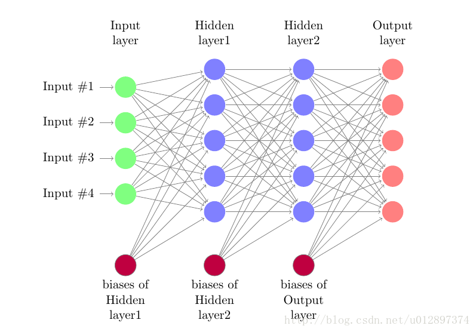
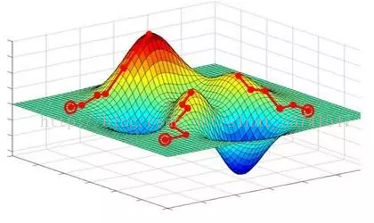
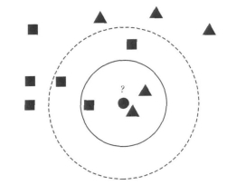

# 数据挖掘Lab3实验报告

161220096 欧阳鸿荣


## 1.实验要求

在提供的数据集上，基于10折的交叉验证，使用J48(C4.8)，朴素贝叶斯，SVM，神经网络，kNN算法以及它们使用装袋(Bagging)的集成学习的版本对数据集训练。基于如accuracy，AUC等指标比较各种方法的表现。讨论各种方法的表现并且说明如何优化基于Bagging的kNN算法的性能。


## 2.实验配置

综合考虑数据集格式(arff)等多方面原因，本次实验采用Weka进行数据挖掘。使用的是Weka 3.8版本。

对于实验要求的算法，J4.8 (C4.5)、Naïve Bayes、神经网络和kNN在Weka中都有提供。其中，神经网络采用的是Weka中的Multilayer Perceptron多层感知机，kNN算法采用Weka中的IBk(K-nearest neighbours classifier)分类器。而对于Weka默认安装里缺少的SVM，使用的是weka库中的libSVM进行实验。

在实验中，在对比多个方法的任务中，统一采用原始数据，10-fold cross validation和weka中的默认配置进行分类器的训练。在对kNN的优化中，才考虑对数据预处理和修改默认配置等因素。同时，在实验过程中发现libSVM的表现很不稳定，因此对其进行数据预处理实验进行对比，从此发现了对数据标准化等预处理手段的重要性。


## 3.实验原理

### 3.1 J4.8 (C4.5)

决策树是对数据进行分类，以此达到预测的目的。该决策树方法先根据训练集数据形成决策树，如果该树不能对所有对象给出正确的分类，那么选择一些例外加入到训练集数据中，重复该过程一直到形成正确的决策集。

决策树代表着决策集的树形结构。决策树由决策结点、分支和叶子组成。决策树中最上面 的结点为根结点，每个分支是一个新的决策结点，或者是树的叶子。每个决策结点代表一个问题或决策，通常 对应于待分类对象的属性。每一个叶子结点代表一种可能的分类结果。沿决策树从上到下遍历的过程中，在每个结点都会遇到一个测试，对每个结点上问题的不同的 测试输出导致不同的分支，最后会到达一个叶子结点，这个过程就是利用决策树进行分类的过程，利用若干个变量来判断所属的类别。

因此，J48决策树算法基于从上到下的策略，递归的分治策略，选择某个属性放置在根节点，为每个可能的属性值产生一个分支，将实例分成多个子集，每个子集对应一个根节点的分支，然后在每个分支上递归地重复这个过程。当所有实例有相同的分类时，停止。属性的选择采用是信息增益，其公式如下：
$$
\begin{aligned}
&Gain(A)=Info(D)-Info_A(D)\\
&Info_A(D)=\sum_{i=1}^v\frac{n_i}{n}Info(D_i)\\
&Info(D)=Entropy(D)=-\sum_{j}p(j|D)logp(j|D)\\
\end{aligned}
$$
因此算法有如下特性：

1. 用信息增益率来选择属性，克服了用信息增益选择属性时偏向选择取值多的属性的不足；
2. 在树构造过程中进行剪枝；
3. 能够完成对连续属性的离散化处理；
4. 能够对不完整数据进行处理。

### 3.2 Naïve Bayes

**贝叶斯算法均以贝叶斯定理为基础，**故统称为贝叶斯分类。贝叶斯定理如下：
$$
P(B|A)=\frac{P(A|B)P(B)}{P(A)}
$$
**朴素贝叶斯的思想基础是这样的：**对于给出的待分类项，求解在此项出现的条件下各个类别出现的概率，哪个最大，就认为此待分类项属于哪个类别。朴素贝叶斯分类的正式定义如下：

1、设$x={a_1,a_2,...,a_m}​$为一个待分类项，而每个$a​$为$x​$的一个特征属性。

2、有类别集合$C={y_1,y_2,...,y_n}​$。

3、计算$P(y_1|x),P(y_2|x),...P(y_n|x)​$

4、如果$P(y_k|x)=max\{P(y_1|x),P(y_2|x),...,P(y_n|x)\}$，则$x \in y_k$。

那么现在的关键就是如何计算第3步中的各个条件概率。我们可以这么做：

1、找到一个已知分类的待分类项集合，这个集合叫做训练样本集。

2、统计得到在各类别下各个特征属性的条件概率估计。即

$P(a_1|y_1),P(a_2|y_1),...,P(a_m|y_1);P(a_1|y_2),P(a_2|y_2),...,P(a_m|y_2);...;P(a_1|y_n),P(a_2|y_n),...,P(a_m|y_n)$。

3、如果各个特征属性是条件独立的，则根据贝叶斯定理有如下推导：

​      $P(y_i|x)=\frac{P(x|y_i)P(y_i)}{P(x)}$

因为分母对于所有类别为常数，因为我们只要将分子最大化皆可。又因为各特征属性是条件独立的，所以有：

​    $P(x|y_i)P(y_i)=P(a_1|y_i)P(a_2|y_i)...P(a_m|y_i)P(y_i)=P(y_i)\prod^m_{j=1}P(a_j|y_i)$

**整个朴素贝叶斯分类分为三个阶段：**

**第一阶段**——准备工作阶段，这个阶段的任务是为朴素贝叶斯分类做必要的准备，主要工作是根据具体情况确定特征属性，并对每个特征属性进行适当划分，然后由人工对一部分待分类项进行分类，形成训练样本集合。这一阶段的输入是所有待分类数据，输出是特征属性和训练样本。这一阶段是整个朴素贝叶斯分类中唯一需要人工完成的阶段，其质量对整个过程将有重要影响，分类器的质量很大程度上由特征属性、特征属性划分及训练样本质量决定。

**第二阶段**——分类器训练阶段，这个阶段的任务就是生成分类器，主要工作是计算每个类别在训练样本中的出现频率及每个特征属性划分对每个类别的条件概率估计，并将结果记录。其输入是特征属性和训练样本，输出是分类器。这一阶段是机械性阶段，根据前面讨论的公式可以由程序自动计算完成。

**第三阶段**——应用阶段。这个阶段的任务是使用分类器对待分类项进行分类，其输入是分类器和待分类项，输出是待分类项与类别的映射关系。这一阶段也是机械性阶段，由程序完成。

### 3.3 SVM

SVM的全称是Support Vector Machine，即支持向量机，主要用于解决模式识别领域中的数据分类问题，属于有监督学习算法的一种。SVM要解决的问题可以用一个经典的二分类问题加以描述。

如下图所示，红色和蓝色的二维数据点显然是可以被一条直线分开的，在模式识别领域称为线性可分问题。然而将两类数据点分开的直线显然不止一条。图(b)和(c)分别给出了A、B两种不同的分类方案，其中黑色实线为分界线，术语称为“决策面”。每个决策面对应了一个线性分类器。虽然在目前的数据上看，这两个分类器的分类结果是一样的，但如果考虑潜在的其他数据，则两者的分类性能是有差别的。

<div>
    
</div>

SVM算法认为上图中的分类器A在性能上优于分类器B，其依据是A的分类间隔比B要大。这里涉及到第一个SVM独有的概念“分类间隔”。在保证决策面方向不变且不会出现错分样本的情况下移动决策面，会在原来的决策面两侧找到两个极限位置（越过该位置就会产生错分现象），如虚线所示。虚线的位置由决策面的方向和距离原决策面最近的几个样本的位置决定。而这两条平行虚线正中间的分界线就是在保持当前决策面方向不变的前提下的最优决策面。两条虚线之间的垂直距离就是这个最优决策面对应的分类间隔。显然每一个可能把数据集正确分开的方向都有一个最优决策面（有些方向无论如何移动决策面的位置也不可能将两类样本完全分开），而不同方向的最优决策面的分类间隔通常是不同的，那个具有“最大间隔”的决策面就是SVM要寻找的最优解。而这个真正的最优解对应的两侧虚线所穿过的样本点，就是SVM中的支持样本点，称为“支持向量”。对于上图中的数据，A决策面就是SVM寻找的最优解，而相应的三个位于虚线上的样本点在坐标系中对应的向量就叫做支持向量。

从表面上看，我们优化的对象似乎是这个决策面的方向和位置。但实际上最优决策面的方向和位置完全取决于选择哪些样本作为支持向量。而在经过漫长的公式推导后，你最终会发现，其实与线性决策面的方向和位置直接相关的参数都会被约减掉，最终结果只取决于样本点的选择结果。

到这里，我们明确了SVM算法要解决的是一个最优分类器的设计问题。既然叫作最优分类器，其本质必然是个最优化问题。而优化的目的，直观而言其实是使得下图的间隔最大：

<div style="text-align:center">
    
</div>


间隔的大小实际上就是支持向量对应的样本点到决策面的距离的二倍。分类间隔计算就是点到直线的距离公式
$$
d = \frac{|\boldsymbol{\omega}^T\boldsymbol{x}+\gamma|}{||\boldsymbol{\omega}||}
$$
$||\boldsymbol{\omega}||$是向量$\boldsymbol{\omega}$的模，表示在空间中向量的长度，$\boldsymbol{x}=[x_1,x_2]^T$就是支持向量样本点的坐标。$\boldsymbol{\omega}, \gamma$就是决策面方程的参数。而追求$W$的最大化也就是寻找$d$的最大化。这就是SVM的原理。后续便是数学问题了，这里不多赘述。

### 3.4 Neural Network

神经网络是由具有适应性的简单单元组成的广泛并行互连的网络，它的组织能够模拟生物神经系统对真实世界物体所做出的交互反应。

#### 3.4.1 Neural Network的组成

##### (1) 神经元模型与阈值

神经元模型，即上述定义中的简单单元。在生物神经网络中，每个神经元与其他神经元相连，当它兴奋时，就会向相连的神经元发送化学物质，从而改变这些神经元内的电位；如果某神经元的电位超过了一个阈值，那么它就会激活，即兴奋起来。向其他神经元发送化学物质。我们把上述的这种神经元模型抽象出来，这就是M-P神经元模型：

<div style="text-align:center">
    
</div>

神经元接受输入x，通过带权重w的连接进行传递，将总输入信号与神经元的阈值进行比较，最后通过激活函数处理确定是否激活。阈值，又称为bias，其含义有点类似阀门。在计算中，可以将阈值看作一个固定输入为-1的哑节点对应的连接权重。

##### (2) 激活函数

 理想中的激活函数是阶跃函数，但实际使用中由于阶跃函数不光滑，不连续，一般使用sigmoid或tanh函数：

<div style="text-align:center">
    
</div>

#### 3.4.2 多层前馈神经网络

多层层神经元，即输入层+输出层(M-P神经元),构成感知机。而多层功能神经元相连构成多层前馈神经网络，输入层与输出层之间的神经元，称为隐层：

<div style="text-align:center">
    
</div>

如图所示，每层神经元与下一层神经元互连，神经元之间不存在同层连接，也不存在跨层链接，这样的结构称多层前馈神经网络。

#### 3.4.3 误差逆传播

神经网络学习的过程，其实就是根据训练数据，来调整神经元之间的连接权w以及每个功能神经元阈值b的过程。误差逆传播就是其中一种广为人知的训练方法，其核心的思想非常简单，对于训练数据(x，y)，若当前神经网络的输出为Y，则神经网络的权重：
$$
w = w + *w， 其中*w = n(y - Y)x
$$
从上可以看出，假设训练结果正确，则权重w不会发生改变；假如错误，则会对w进行一定调整，其中n为学习率，对学习速度有影响。多层神经网络从输出层往输入层逆方向传播误差进行权重调整，即误差逆传播算法。

#### 3.4.4 最优解

神经网络的训练过程即是一个参数寻优过程，基于梯度下降求得的可能是局部最优但不一定是全局最优解,所以实际调参过程中，往往需要多次试验，才能得到一个较为满意的模型。

<div style="text-align:center">
    
</div>


### 3.5 kNN

kNN(k-nearest neighbor)是一个简单而经典的机器学习分类算法，通过度量”待分类数据”和”类别已知的样本”的距离（通常是欧氏距离）对样本进行分类。 KNN假设数据都分布在欧式的特征空间内，并假设：**空间中距离越近的点属于一类的可能性越大。** 只需要计算每个待分类数据到全部已知类别数据的距离即可。

<div style="text-align:center">
    
</div>

举例而言，对上图，有正方形和三角形两个已知类，假如中间的圆形我们不知道它到底是三角形还是正方形。如上所述，计算一下它到其他所有点的距离。发现它离旁边的三角形最近，那么我们就把它归为三角形一类。 这里我们把未知点和离它最近的那一个点归为一类。这样的分类器，准确来说叫**最近邻分类器（nearest-neighbor，NN）**。这是KNN的特殊情况，是K=1的情况。

 那么K近邻，顾名思义，就是要一个未知点参考离它最近的前k个一直类别的点，看在这k个点里面，属于哪个类别的点最多，就认为未知点属于哪一类。还是上面的图，以圆形未知点为圆心，在实线画出的圆中，相当于k=3，也就是选了前三个离得最近的点，其中三角形2个，方形1个，所以未知点归到三角形一类。但是当考虑虚线范围内时，也就是k=5时，我们发现方形3个，三角形2个，所以这个时候未知点归到方形一类了。 
不同的最近邻个数会导致不同的分类结果，一般来说，我们在实际应用中要根据实际情况和经验确定k的取值。

**算法流程如下：**
对每一个未知点执行：

1. 计算未知点到所有已知类别点的距离
2. 按距离排序（升序）
3. 选取其中前k个与未知点离得最近的点
4. 统计k个点中各个类别的个数
5. 上述k个点里类别出现频率最高的作为未知点的类别

<div STYLE="page-break-after: always;"></div> 

## 4.实验过程与实验结果

### 4.1 数据集基本情况

| 数据集        | Attributes | Instances | 数据规模 |
| ------------- | ---------- | --------- | -------- |
| breast-w      | 10         | 699       | 6990     |
| colic         | 23         | 368       | 8464     |
| credit-a      | 16         | 690       | 11040    |
| credit-g      | 21         | 1000      | 21000    |
| diabetes      | 9          | 768       | 6912     |
| hepatitis     | 20         | 155       | 3100     |
| mozilla4      | 6          | 15545     | 93270    |
| pc1           | 22         | 1109      | 24398    |
| pc5           | 39         | 17186     | 670254   |
| waveform-5000 | 41         | 5000      | 205000   |

### 4.2 五种方法的对比

该任务中，统一采用原始数据，10-fold cross validation和weka中的默认配置进行分类器的训练。其中J4.8 (C4.5)、Naïve Bayes采用Weka中默认版本，神经网络采用的是Weka中的Multilayer Perceptron多层感知机，kNN算法采用Weka中的IBk分类器。SVM使用的是weka库中的libSVM进行实验。

训练的模型和结果都放在```output```目录下，由于Markdown表格能力有限，结果备份在```实验三结果统计.xlsx```下。

#### 1 breast-w 数据集

| 数据规模：6990 | 基础方法    | 基础方法    | Bagging    | Bagging   | 变化量   | 变化量 |
| -------------- | ----------- | ----------- | ---------- | --------- | -------- | ------ |
| 挖掘算法       | Accuracy    | ROC         | Accuracy   | ROC       | Accuracy | ROC    |
| J4.8   (C4.5)  | 94.56%      | 0.955       | **96.28%** | 0.985     | 1.72%    | 0.03   |
| Naïve Bayes    | **95.99%**  | **0.986**   | 95.85%     | **0.989** | -0.14%   | 0.003  |
| SVM            | 95.71%      | 0.964       | 95.42%     | 0.973     | -0.29%   | 0.009  |
| Neural Network | 95.28%      | 0.986       | 95.99%     | **0.989** | 0.72%    | 0.003  |
| kNN            | 95.14%      | 0.973       | 95.85%     | 0.987     | 0.72%    | 0.014  |
| 最大值         | 95.99%      | 0.986       | 96.28%     | 0.989     |          |        |
| 最优算法       | Naïve Bayes | Naïve Bayes | J48        | NB/NN     |          |        |

#### 2 colic 数据集

| 数据规模：8464 | 基础方法   | 基础方法       | Bagging    | Bagging        | 变化量   | 变化量 |
| -------------- | ---------- | -------------- | ---------- | -------------- | -------- | ------ |
| 挖掘算法       | Accuracy   | ROC            | Accuracy   | ROC            | Accuracy | ROC    |
| J4.8   (C4.5)  | **85.33%** | 0.813          | **85.60%** | 0.864          | 0.27%    | 0.051  |
| Naïve Bayes    | 77.99%     | 0.842          | 77.99%     | 0.842          | 0.00%    | 0      |
| SVM            | 72.55%     | 0.67           | 69.57%     | 0.692          | -2.99%   | 0.022  |
| Neural Network | 80.43%     | **0.857**      | 84.51%     | **0.876**      | 4.08%    | 0.019  |
| kNN            | 81.25%     | 0.802          | 81.25%     | 0.824          | 0.00%    | 0.022  |
| 最大值         | 85.33%     | 0.857          | 85.60%     | 0.876          |          |        |
| 最优算法       | J48        | Neural Network | J48        | Neural Network |          |        |

#### 3 credit-a 数据集

| 数据规模：11040 | 基础方法   | 基础方法    | Bagging    | Bagging   | 变化量   | 变化量 |
| --------------- | ---------- | ----------- | ---------- | --------- | -------- | ------ |
| 挖掘算法        | Accuracy   | ROC         | Accuracy   | ROC       | Accuracy | ROC    |
| J4.8   (C4.5)   | **86.09%** | 0.887       | **86.81%** | **0.928** | 0.72%    | 0.041  |
| Naïve Bayes     | 77.68%     | **0.896**   | 77.83%     | 0.896     | 0.14%    | 0      |
| SVM             | 55.51%     | 0.513       | 55.80%     | 0.535     | 0.29%    | 0.022  |
| Neural Network  | 83.62%     | 0.895       | 85.07%     | 0.908     | 1.45%    | 0.013  |
| kNN             | 81.16%     | 0.808       | 81.30%     | 0.886     | 0.14%    | 0.078  |
| 最大值          | 86.09%     | 0.896       | 86.81%     | 0.928     |          |        |
| 最优算法        | J48        | Naïve Bayes | J48        | J48       |          |        |

<div STYLE="page-break-after: always;"></div> 

#### 4.credit-g 数据集

| 数据规模：21000 | 基础方法    | 基础方法    | Bagging        | Bagging     | 变化量   | 变化量 |
| --------------- | ----------- | ----------- | -------------- | ----------- | -------- | ------ |
| 挖掘算法        | Accuracy    | ROC         | Accuracy       | ROC         | Accuracy | ROC    |
| J4.8   (C4.5)   | 70.50%      | 0.639       | 73.30%         | 0.753       | 2.80%    | 0.114  |
| Naïve Bayes     | **75.40%**  | **0.787**   | 74.80%         | **0.787**   | -0.60%   | 0      |
| SVM             | 68.70%      | 0.491       | 68.60%         | 0.49        | -0.10%   | -0.001 |
| Neural Network  | 71.50%      | 0.73        | **76.10%**     | 0.776       | 4.60%    | 0.046  |
| kNN             | 72%         | 0.66        | 72.10%         | 0.694       | 0.10%    | 0.034  |
| 最大值          | 75.40%      | 0.787       | 76.10%         | 0.787       |          |        |
| 最优算法        | Naïve Bayes | Naïve Bayes | Neural Network | Naïve Bayes |          |        |

#### 5.diabetes 数据集

| 数据规模：6912 | 基础方法    | 基础方法    | Bagging        | Bagging        | 变化量   | 变化量 |
| -------------- | ----------- | ----------- | -------------- | -------------- | -------- | ------ |
| 挖掘算法       | Accuracy    | ROC         | Accuracy       | ROC            | Accuracy | ROC    |
| J4.8   (C4.5)  | 73.83%      | 0.751       | 74.61%         | 0.798          | 0.78%    | 0.047  |
| Naïve Bayes    | **76.30%**  | **0.819**   | 76.56%         | 0.817          | 0.26%    | -0.002 |
| SVM            | 65.10%      | 0.5         | 65.10%         | 0.5            | 0.00%    | 0      |
| Neural Network | 75.39%      | 0.793       | **76.82%**     | **0.822**      | 1.43%    | 0.029  |
| kNN            | 70.18%      | 0.65        | 71.09%         | 0.725          | 0.91%    | 0.075  |
| 最大值         | 76.30%      | 0.819       | 76.82%         | 0.822          |          |        |
| 最优算法       | Naïve Bayes | Naïve Bayes | Neural Network | Neural Network |          |        |

<div STYLE="page-break-after: always;"></div> 

#### 6.hepatitis 数据集

| 数据规模：3100 | 基础方法    | 基础方法    | Bagging     | Bagging     | 变化量   | 变化量 |
| -------------- | ----------- | ----------- | ----------- | ----------- | -------- | ------ |
| 挖掘算法       | Accuracy    | ROC         | Accuracy    | ROC         | Accuracy | ROC    |
| J4.8   (C4.5)  | 83.87%      | 0.708       | 83.87%      | 0.865       | 0.00%    | 0.157  |
| Naïve Bayes    | **84.52%**  | **0.86**    | **85.81%**  | **0.89**    | 1.29%    | 0.03   |
| SVM            | 79.35%      | 0.5         | 79.35%      | 0.492       | 0.00%    | -0.008 |
| Neural Network | 80%         | 0.823       | 84.52%      | 0.846       | 4.52%    | 0.023  |
| kNN            | 80.65%      | 0.653       | 81.29%      | 0.782       | 0.65%    | 0.129  |
| 最大值         | 84.52%      | 0.86        | 85.81%      | 0.89        |          |        |
| 最优算法       | Naïve Bayes | Naïve Bayes | Naïve Bayes | Naïve Bayes |          |        |

#### 7.mozilla4 数据集

| 数据规模：93270 | 基础方法   | 基础方法  | Bagging    | Bagging   | 变化量   | 变化量 |
| --------------- | ---------- | --------- | ---------- | --------- | -------- | ------ |
| 挖掘算法        | Accuracy   | ROC       | Accuracy   | ROC       | Accuracy | ROC    |
| J4.8   (C4.5)   | **94.80%** | **0.954** | **95.11%** | **0.976** | 0.32%    | 0.022  |
| Naïve Bayes     | 68.64%     | 0.829     | 68.74%     | 0.83      | 0.10%    | 0.001  |
| SVM             | 69.54%     | 0.537     | 69.82%     | 0.549     | 0.28%    | 0.012  |
| Neural Network  | 91.19%     | 0.94      | 91.28%     | 0.945     | 0.10%    | 0.005  |
| kNN             | 88.99%     | 0.877     | 88.86%     | 0.928     | -0.13%   | 0.051  |
| 最大值          | 94.80%     | 0.954     | 95.11%     | 0.976     |          |        |
| 最优算法        | J48        | J48       | J48        | J48       |          |        |

<div STYLE="page-break-after: always;"></div> 

#### 8.pc1 数据集

| 数据规模：24398 | 基础方法       | 基础方法 | Bagging    | Bagging   | 变化量   | 变化量 |
| --------------- | -------------- | -------- | ---------- | --------- | -------- | ------ |
| 挖掘算法        | Accuracy       | ROC      | Accuracy   | ROC       | Accuracy | ROC    |
| J4.8   (C4.5)   | 93.33%         | 0.668    | 93.60%     | **0.855** | 0.27%    | 0.187  |
| Naïve Bayes     | 89.18%         | 0.65     | 88.91%     | 0.628     | -0.27%   | -0.022 |
| SVM             | 93.51%         | 0.563    | **93.87%** | 0.574     | 0.36%    | 0.011  |
| Neural Network  | **93.60%**     | 0.723    | 93.33%     | 0.835     | -0.27%   | 0.112  |
| kNN             | 92.06%         | **0.74** | 91.07%     | 0.793     | -0.99%   | 0.053  |
| 最大值          | 93.60%         | 0.74     | 93.87%     | 0.855     |          |        |
| 最优算法        | Neural Network | kNN      | SVM        | J48       |          |        |

#### 9.pc5 数据集

| 数据规模：670254 | 基础方法   | 基础方法       | Bagging    | Bagging   | 变化量   | 变化量 |
| ---------------- | ---------- | -------------- | ---------- | --------- | -------- | ------ |
| 挖掘算法         | Accuracy   | ROC            | Accuracy   | ROC       | Accuracy | ROC    |
| J4.8   (C4.5)    | **97.46%** | 0.817          | **97.53%** | **0.959** | 0.06%    | 0.142  |
| Naïve Bayes      | 96.42%     | 0.833          | 96.48%     | 0.845     | 0.06%    | 0.012  |
| SVM              | 97.25%     | 0.548          | 97.22%     | 0.552     | -0.03%   | 0.004  |
| Neural Network   | 97.10%     | **0.941**      | 97.31%     | 0.954     | 0.21%    | 0.013  |
| kNN              | 97.29%     | 0.932          | 97.37%     | 0.953     | 0.08%    | 0.021  |
| 最大值           | 97.46%     | 0.941          | 97.53%     | 0.959     |          |        |
| 最优算法         | J48        | Neural Network | J48        | J48       |          |        |

<div STYLE="page-break-after: always;"></div> 

#### 10.waveform-5000 数据集

| 数据规模：205000 | 基础方法   | 基础方法       | Bagging    | Bagging        | 变化量   | 变化量 |
| ---------------- | ---------- | -------------- | ---------- | -------------- | -------- | ------ |
| 挖掘算法         | Accuracy   | ROC            | Accuracy   | ROC            | Accuracy | ROC    |
| J4.8   (C4.5)    | 75.08%     | 0.83           | 81.20%     | 0.949          | 6.12%    | 0.119  |
| Naïve Bayes      | 80%        | 0.956          | 79.98%     | 0.956          | -0.02%   | 0      |
| SVM              | **86.42%** | 0.898          | **86.02%** | 0.939          | -0.40%   | 0.041  |
| Neural Network   | 83.56%     | **0.963**      | 85.68%     | **0.969**      | 2.12%    | 0.006  |
| kNN              | 73.62%     | 0.802          | 74.46%     | 0.9            | 0.84%    | 0.098  |
| 最大值           | 86.42%     | 0.963          | 86.02%     | 0.969          |          |        |
| 最优算法         | SVM        | Neural Network | SVM        | Neural Network |          |        |

#### 11.结果综合分析

比较各个数据集的情况，不难发现运用集成学习后，大多数方法的准确率和ROC值都有着提高，说明**Bagging的集成学习方法确实可以提高分类器的准确率。**

根据上述实验结果，整理出各个数据集上Accuracy和ROC值的最优方法如下

| 数据集        | 常规方法       |                | Bagging        |                |
| ------------- | -------------- | -------------- | -------------- | -------------- |
| 名称          | 准确率最优     | ROC最优        | 准确率最优     | ROC最优        |
| breast-w      | Naïve Bayes    | Naïve Bayes    | J48            | NB/NN          |
| colic         | J48            | Neural Network | J48            | Neural Network |
| credit-a      | J48            | Naïve Bayes    | J48            | J48            |
| credit-g      | Naïve Bayes    | Naïve Bayes    | Neural Network | Naïve Bayes    |
| diabetes      | Naïve Bayes    | Naïve Bayes    | Neural Network | Neural Network |
| hepatitis     | Naïve Bayes    | Naïve Bayes    | Naïve Bayes    | Naïve Bayes    |
| mozilla4      | J48            | J48            | J48            | J48            |
| pc1           | Neural Network | kNN            | SVM            | J48            |
| pc5           | J48            | Neural Network | J48            | J48            |
| waveform-5000 | SVM            | Neural Network | SVM            | Neural Network |

<div STYLE="page-break-after: always;"></div> 

根据上述结果，可以发现，在10个数据集中，五种方法的最优分布如下

| 方法           | 常规方法   |         | Bagging    |         | 总结       |         |
| -------------- | ---------- | ------- | ---------- | ------- | ---------- | ------- |
| 名称           | 准确率最优 | ROC最优 | 准确率最优 | ROC最优 | 准确率最优 | ROC最优 |
| J4.8 (C4.5)    | 4          | 1       | 5          | 4       | 9          | 5       |
| Naïve Bayes    | 4          | 5       | 1          | 3       | 5          | 8       |
| SVM            | 1          | 0       | 2          | 0       | 3          | 0       |
| Neural Network | 1          | 3       | 2          | 4       | 3          | 7       |
| kNN            | 0          | 1       | 0          | 0       | 0          | 1       |

不难看出，在给定的数据集上使用默认参数时，各方法表现如下，

- J48的效果最佳的频数是最多的，但是其ROC的表现就稍有欠缺。

- 朴素贝叶斯方法在准确率和ROC上都有不错的表现，性能较为平衡。

- SVM的表现较不稳定，其准确率的上限可以达到很高，但下限却无法保证，与其他方法对比常常处于很糟糕的水平，这里猜测是使用的libSVM库和数据预处理的问题，因此后文专门针对SVM进行数据预处理特殊试验。

- 神经网络的表现也是中规中矩，但是其ROC的性能处于很高的水平。

- kNN没有什么亮点，可能是应用默认参数的原因，也许这就是后续实验需要对kNN进行参数调优的原因。

  

而若考虑数据集规模和不同分类器的表现，有如下表格（按照属性数升序）：
| 数据集        | Attributes | Instances | sum    | 常规方法   |         | Bagging    |         |
| ------------- | ---------- | --------- | ------ | ---------- | ------- | ---------- | ------- |
| 名称          | 属性数     | 样本数    | 规模   | 准确率最优 | ROC最优 | 准确率最优 | ROC最优 |
| mozilla4      | 6          | 15545     | 93270  | J48        | J48     | J48        | J48     |
| diabetes      | 9          | 768       | 6912   | NB         | NB      | NN         | NN      |
| breast-w      | 10         | 699       | 6990   | NB         | NB      | J48        | NB/NN   |
| credit-a      | 16         | 690       | 11040  | J48        | NB      | J48        | J48     |
| hepatitis     | 20         | 155       | 3100   | NB         | NB      | NB         | NB      |
| credit-g      | 21         | 1000      | 21000  | NB         | NB      | NN         | NN      |
| pc1           | 22         | 1109      | 24398  | NN         | kNN     | SVM        | J48     |
| colic         | 23         | 368       | 8464   | J48        | NN      | J48        | NN      |
| pc5           | 39         | 17186     | 670254 | J48        | NN      | J48        | J48     |
| waveform-5000 | 41         | 5000      | 205000 | SVM        | NN      | SVM        | NN      |

<div STYLE="page-break-after: always;"></div> 

根据上述表格，不难得到以下结论

- J48的表现较为稳定，在不同数据维度和样本容量上都能有较好的效果。

- 朴素贝叶斯在属性数较少时有着较好的效果（猜测是此时对于独立性的满足程度较高

- 神经网络在属性数和样本数较高时都有良好的表现

- SVM虽然不稳定，但在数据维度和数据量较大时能起到较好的效果。

  


### 4.3 归一化SVM的对比

上文也提到，libSVM的效果并非很稳定，出于好奇心，我对于数据集进行了归一化的数据预处理，发现这对于libSVM性能有着巨大的影响，而对于其他方法的影响并不大。下面给出针对数据归一化的SVM的实验数据：

|               | 基础方法 |       | 基础方法归一化 |       | 变化量   |        |
| ------------- | -------- | ----- | -------------- | ----- | -------- | ------ |
| 数据集        | Accuracy | ROC   | Accuracy       | ROC   | Accuracy | ROC    |
| breast-w      | 95.71%   | 0.964 | 96.71%         | 0.965 | 1.00%    | 0.001  |
| colic         | 72.55%   | 0.67  | 84.24%         | 0.813 | 11.68%   | 0.143  |
| credit-a      | 55.51%   | 0.513 | 85.51%         | 0.862 | 30.00%   | 0.349  |
| credit-g      | 68.70%   | 0.491 | 72%            | 0.546 | 3.30%    | 0.055  |
| diabetes      | 65.10%   | 0.5   | 76.95%         | 0.704 | 11.85%   | 0.204  |
| hepatitis     | 79.35%   | 0.5   | 80.65%         | 0.589 | 1.29%    | 0.089  |
| mozilla4      | 69.54%   | 0.537 | 84.99%         | 0.848 | 15.45%   | 0.311  |
| pc1           | 93.51%   | 0.563 | 93.51%         | 0.563 | 0.00%    | 0      |
| pc5           | 97.25%   | 0.548 | 97.04%         | 0.513 | -0.21%   | -0.035 |
| waveform-5000 | 86.42%   | 0.898 | 86.02%         | 0.895 | -0.40%   | -0.003 |

|               | Bagging  |       | Bagging归一化 |       | 变化量   |        |
| ------------- | -------- | ----- | ------------- | ----- | -------- | ------ |
| 数据集        | Accuracy | ROC   | Accuracy      | ROC   | Accuracy | ROC    |
| breast-w      | 95.42%   | 0.973 | 96.71%        | 0.972 | 1.29%    | -0.001 |
| colic         | 69.57%   | 0.692 | 84.24%        | 0.856 | 14.67%   | 0.164  |
| credit-a      | 55.80%   | 0.535 | 85.51%        | 0.863 | 29.71%   | 0.328  |
| credit-g      | 68.60%   | 0.49  | 73%           | 0.692 | 4.40%    | 0.202  |
| diabetes      | 65.10%   | 0.5   | 76.04%        | 0.732 | 10.94%   | 0.232  |
| hepatitis     | 79.35%   | 0.492 | 81.94%        | 0.77  | 2.58%    | 0.278  |
| mozilla4      | 69.82%   | 0.549 | 84.91%        | 0.861 | 15.09%   | 0.312  |
| pc1           | 93.87%   | 0.574 | 93.87%        | 0.574 | 0.00%    | 0      |
| pc5           | 97.22%   | 0.552 | 97.05%        | 0.528 | -0.17%   | -0.024 |
| waveform-5000 | 86.02%   | 0.939 | 86.02%        | 0.939 | 0.00%    | 0      |

不难看出，归一化后SVM算法的性能得到了显著的提高。这让我深刻意识到了数据预处理的重要性。


#### 4.4 kNN算法的调优

考虑到数据集的规模和准确率，这里对credit-a  数据集进行调优，根据Weka中的默认值，对照基本结果如下：

|           | 准确率    | ROC   |
| --------- | --------- | ----- |
| 未Bagging | 81.1594 % | 0.808 |
| Bagging   | 81.3043 % | 0.886 |

根据本次实验中的经验，对数据归一化处理后训练速度会加快，而Bagging集成学习的效果大多数情况下会提高，因此优化过程中，我们的起点方案便是选取**归一化的Bagging方案为起点，并在其基础上进行优化。**

#### 1.调整最近邻搜索算法

Weka中的kNN默认使用的是LinearNNseach算法 ，因此我们考虑用不同的最近邻搜索方法调优。而在此之前，对缺失值进行处理(使用ReplaceMissingValues过滤器)，用均值代替缺失值。

| 最近邻搜索算法          | 准确率    | ROC   |
| ----------------------- | --------- | ----- |
| BallTree                | 81.3043 % | 0.889 |
| CoverTree               | 81.3043 % | 0.887 |
| FilteredNeighbourSearch | 81.3043 % | 0.889 |
| KDTree                  | 81.3043 % | 0.889 |
| LinearNNseach           | 81.3043 % | 0.889 |

可以发现在这个数据集下，各个最近邻搜索函数在默认参数下性能差距不大。因此依然使用LinearNNseach算法

#### 2.调整距离函数

Weka中的kNN默认使用的是欧氏距离，因此我们考虑使用不同距离函数来调优

| 距离函数            | 准确率    | ROC   |
| ------------------- | --------- | ----- |
| Euclidean distance  | 81.3043 % | 0.889 |
| Chebyshev distance. | 76.3768 % | 0.828 |
| FilteredDistance    | 79.1304 % | 0.865 |
| Manhattan distance  | 80.8696 % | 0.888 |
| Minkowski distance  | 81.3043 % | 0.889 |

不难看出，Euclidean距离和Minkowski距离在该数据集上表现最好，因此还是采用默认的Euclidean距离进行下一步实验。

#### 3.调整距离权重

这是kNN算法中一种常见的调优：为每个点的距离增加一个权重，使得距离近的点可以得到更大的权重，而Weka中默认的是不加权的，因此我尝试调整距离权重以期望达到较好的效果：

| 距离权重   | 准确率    | ROC   |
| ---------- | --------- | ----- |
| 无         | 81.3043 % | 0.889 |
| 1/distance | 81.1594 % | 0.890 |
| 1-distance | 81.0145 % | 0.891 |

可以发现调整距离权重后，ROC值有些些许提高，但是准确率却下降了，因此选择不设距离权重。

#### 4.调整k值

Weka中的kNN默认近邻数k值是1，基于上文中的结果，采用LinearNNseach算法，欧式距离，不设距离权重，调整K值，观察实验结果。

| k值  | 准确率    | ROC   |
| ---- | --------- | ----- |
| 1    | 81.3043 % | 0.889 |
| 2    | 84.2029 % | 0.899 |
| 3    | 85.6522 % | 0.907 |
| 4    | 86.5217 % | 0.906 |
| 5    | 86.5217 % | 0.911 |
| 6    | 86.5217 % | 0.911 |
| 7    | 86.2319 % | 0.910 |
| 8    | 86.087  % | 0.913 |
| 9    | 86.5217 % | 0.914 |
| 10   | 86.087  % | 0.913 |
| 20   | 85.942  % | 0.911 |

可以看出，当选取的近邻数k值在5附近时，准确率达到较高水平86.5217，已经接近实验中该数据集的最高准确率(J48的86.81%)，因此我们认为k=5时kNN算法的性能达到最优


## 5.实验结果和感悟

- 数据预处理（如归一化和缺失值处理）对于数据挖掘结果的准确性起着很大的作用
- 大多数情况下，集成学习能够显著提高分类算法的准确率和ROC值
- 各个分类算法都有其适用的场景和优点
  - **J48(C4.5)**的表现较为稳定，在不同数据维度和样本容量上都能有较好的效果。且其具有较好的解释性，在Weka中也可以导出其决策树。而且对于各类型数据都能很好地兼容处理，并且能够在相对短的时间内能够对大型数据源做出可行且效果良好的结果。
  - **朴素贝叶斯**在属性数较少时有着较好的效果（猜测是此时对于独立性的满足程度较高），对缺失数据不太敏感，算法也比较简单。在属性相关性较小时，朴素贝叶斯模型的性能最为良好。在属性个数比较多或者属性之间相关性较大时，朴素贝叶斯的分类效率比不上决策树模型。
  - **神经网络**在属性数和样本数较高时都有良好的表现，其分类的准确度高,对噪声数据有较强的鲁棒性和容错能力，能充分逼近复杂的非线性关系。但是神经网络训练时间相比其他方法要长很多，同时解释性不强。
  - **SVM**虽然不稳定，但在数据维度和数据量较大时能起到较好的效果。SVM可以提高泛化性能，解决高维问题和非线性问题，但是对非线性问题没有通用解决方案，必须谨慎选择核函数来处理。
  - **kNN**算法简单、有效，适用于样本容量比较大的类域的自动分类，且对于样本重叠较多的数据集能起到较好的效果。但是KNN算法是lazy learning，速度较慢且计算量较大。
- 对于kNN算法，最近邻搜索算法，距离函数，距离权重的选取都会对性能和结果产生很大影响。而提高最近邻数k值是提高kNN算法最简单直接有效的办法之一。
- 在数据挖掘和机器学习过程中，调参真的是一件很玄学又很有趣的事情，有时对于参数稍微调整便可以取得很好的效果，但自己又不知道为什么会有这种效果。


## 6.参考链接

[1.数据预处理和weka.filters的使用--数据挖掘学习和weka使用（三）](https://www.cnblogs.com/htynkn/archive/2012/04/02/weka_3.html)

[2.关于机器学习的Weka软件详细教程（转载） ](https://www.baidu.com/link?url=bS6k4338C8UZJU2EmOuF246oZ_Vyb3_FxfgDIshHfoGy7tYI91uYHzVIm_N15nMWOvTxgMFY0ZButveI7ifynOiUc-3LT03BZE3zGr6Wlo3&wd=&eqid=9f0a6856001201a3000000035cd90d38)

[3.Weka SVM lib 下载](https://blog.csdn.net/jiandanjinxin/article/details/51566819)

[4.Weka BP神经网络（Neural Networks）分析](https://endual.iteye.com/blog/1222693)

[5.[机器学习]K近邻算法及其应用--WEKA工具](https://www.baidu.com/link?url=CfNJ9V2d8zaJLMNZ32YjUicevxKbf0t1ncIRv6qmCoFK6DgcVcJJJhgKavg8829C3yPURobuJO3qkQCerhxJRVxEZ9_f6T_AmM2SB5b6N8S&wd=&eqid=fd4e9c370006207d000000035cd920cb)

[6.各类分类算法比较](https://www.cnblogs.com/zhizhan/p/5313331.html)

[7.决策树中J48算法分析](https://www.cnblogs.com/09120912zhang/p/7235358.html)

[8.朴素贝叶斯原理极其实现](https://www.cnblogs.com/sxron/p/5452821.html)

[9.零基础学SVM—Support Vector Machine(一)](https://zhuanlan.zhihu.com/p/24638007)

[10.神经网络简单介绍](https://blog.csdn.net/sinat_33741547/article/details/76652611)

[11.KNN算法的原理及简单实现](https://blog.csdn.net/weixin_41988628/article/details/80369850)